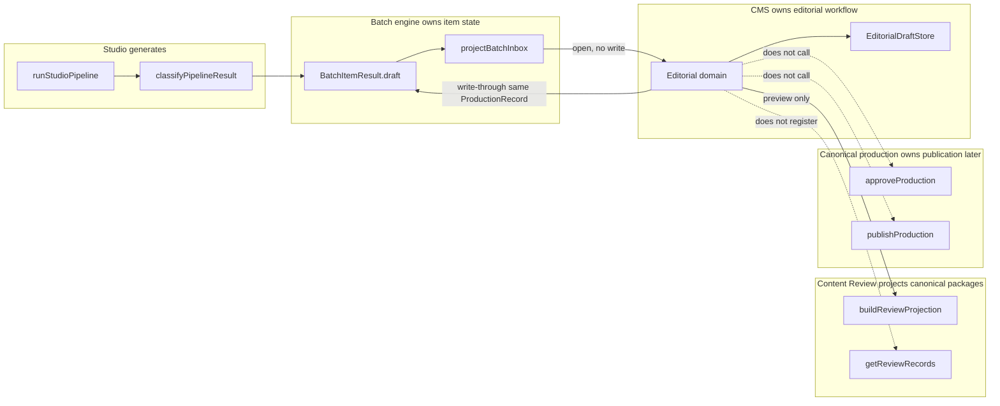
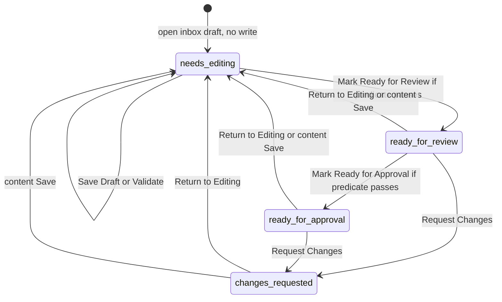

# Editorial CMS Workspace

**Date:** 2026-09-23
**Status:** Draft
**Author:** Sajib Atlas architecture
**Architecture baseline:** V10.7 documentation overlay. Implementation source of truth is the repository, not the Master Vision.
**Scope of this document:** design only. No production code, route, or canonical package is added by this document.

## 1. Purpose

The Content Production Studio can already generate a `ProductionRecord` draft, persist it on a batch item, and list it in the Production Inbox. Nothing in that path is an editor. A human cannot correct the draft, record editorial notes, or move an explicit editorial workflow without either regenerating the item or treating `/content-review` as a CMS. `/content-review` is the wrong place: `getReviewRecords` in `src/lib/content/review/registry.ts` returns only the locally registered canonical packages, and `recordEditorialHandoff` hard-codes `registeredInContentReview: false`.

This design adds an Editorial CMS Workspace that opens the same studio `ProductionRecord` from the inbox, edits the fields the implemented `PilotPackage` already allows, and records a separate editorial workflow. The workflow stops at `ready_for_approval`. Approval and publication stay in `src/lib/content/production/workflow.ts` and are not called. The workspace reuses the Universal Content Schema as implemented by `PilotPackage`, the existing provenance chain Claim → SourceReference → Source, and the existing Content Quality Gate through `evaluateProductionQuality`. It does not create a second schema, a second provenance system, or a second quality gate.

## 2. Scope

The workspace is a local-first, development-only authoring surface for one operator and one editorial record per batch item.

In scope:

- Open a generated batch item that already has `BatchItemResult.draft` without writing.
- Edit that same `ProductionRecord` and write it back only on an explicit save or on an advancing transition that commits.
- Editorial statuses `needs_editing`, `ready_for_review`, `changes_requested`, and `ready_for_approval`.
- Actions Save Draft, Validate, Mark Ready for Review, Mark Ready for Approval, Request Changes, and Return to Editing.
- Disabled, non-callable placeholders labeled Approve and Publish.
- Read-only quality panel fed by `ContentQualityReport` and `ProductionQualitySnapshot`.
- Provenance panel over existing claims, source references, and sources.
- Editorial notes and a minimal change history stored outside the canonical package.
- `EditorialDraftStore`, with a later file adapter beside the `BatchJobStore` pattern.
- A development-only route `/content-studio/editor/[batchId]/[itemId]`.
- A future `node:assert/strict` verifier in the style of `src/lib/content-studio/verify-batch-engine.ts`.

The current design ends when `editorialStatus` becomes `ready_for_approval`. That status is an editorial declaration. It is not `ProductionWorkflowState` `"approved"` and it is not publication.

## 3. Non-goals

- No call to `approveProduction`, `publishProduction`, `submitProductionForReview`, `recordProductionReview`, `createProductionCorrection`, `deprecateProduction`, or `archiveProduction`.
- No implementation of `ready_for_approval → approved → published`.
- No insertion into `getReviewRecords` and no write that sets `registeredInContentReview` to anything other than `false`.
- No second content schema, provenance model, quality status, or quality gate.
- No new `PilotBlockType`, claim kind, support status, source type, scope kind, or objective verb.
- No minting of topic, discipline, subject, knowledge-unit, block, claim, source, source-reference, concept, objective, or assessment-alignment ids.
- No `contentVersion` increment on draft edit.
- No AI provider call, prompt, retry, or regeneration inside the editorial domain.
- No database, Supabase, HTTP API, authentication, RBAC, multi-user lock, or separate CMS application.
- No Navbar change, no sitemap change, and no production exposure. The route uses the same production `notFound()` posture as `src/app/content-studio/page.tsx`.
- No edit of canonical Geography, `geography-data.ts`, assessment, learner intelligence, search, public AI Ask, platform APIs, commerce, or mobile clients.
- No use of `localStorage` or `STUDIO_STORAGE_KEY` as the editorial domain API.
- No background worker. Persisting a JSON file does not execute generation, validation, approval, or publication.

## 4. Existing architecture reused

| Concern | Existing authority | What the CMS does with it |
|---|---|---|
| Canonical shape | `PilotPackage` in `src/lib/content/pilot/types.ts` | Edits this value. Does not widen it. |
| Identity | `resolveStudioIdentity` in `src/lib/content-studio/identity.ts` | Reads `topicId`, `subjectId`, `disciplineId`. Does not re-slug titles. |
| Draft lifecycle | `createProductionDraft` in `src/lib/content/production/workflow.ts` | Generation already stored a draft. The CMS keeps `workflowState: "draft"` and package lifecycle `"draft"`. |
| Quality | `evaluateProductionQuality` → `validateContentQuality` | Re-runs this function. Reads `QualityStatus`. Never writes a human override. |
| Review preview | `buildReviewProjection` in `src/lib/content/review/projection.ts` | Builds a read-only preview. Does not register the record. |
| Canonical review list | `getReviewRecords` in `src/lib/content/review/registry.ts` | Untouched. |
| Generation result | `BatchItemResult.draft` via `classifyPipelineResult` | The content object being edited. |
| Inbox | `projectBatchInbox` / `ProductionInboxLane` | Entry links only. Lane strings are not editorial statuses. |
| Handoff | `recordEditorialHandoff` | Left as an inbox action. The CMS does not call it and does not flip `registeredInContentReview`. |
| Batch durability | `BatchJobStore`, `createFileBatchJobStore` | Write-through of `result.draft` only, through a new narrow function. |
| Secret scrubbing | `redactSecrets` in `src/lib/content-studio/batch-engine/sanitize.ts` | Applied to note text and history strings only. `scrubStored` is not run on `production`. |
| Browser draft library | `STUDIO_STORAGE_KEY` in `src/lib/content-studio/types.ts` | Not read and not written. |

`parseStudioPackage` already overwrites topic id, discipline id, and subject id from `StudioTopicIdentity`. Block ids, claim ids, source ids, and source-reference ids are parsed and then left stable. `validateIdentity` rejects duplicate ids. The schema design says ids are immutable (`docs/superpowers/specs/2026-09-03-universal-content-schema-design.md`, section 6). This workspace therefore treats every canonical id as immutable.

`createProductionCorrection` increments `contentVersion` by exactly one and only from `published` or `deprecated`. Draft editing must not call it and must not imitate it.

## 5. Domain boundaries

Four axes stay separate. Collapsing any pair is a defect.

| Axis | Type and owner | Values | Studio draft rule |
|---|---|---|---|
| A. Content quality | `QualityStatus` in `src/lib/content-quality/types.ts`. Owner: Content Quality Gate. | `pass`, `warning`, `blocked` | Read-only. Editors cannot override. |
| B. Editorial workflow | `EditorialStatus` defined by this design. Owner: Editorial CMS. | `needs_editing`, `ready_for_review`, `changes_requested`, `ready_for_approval` | Starts at `needs_editing` on open. Stops at `ready_for_approval`. |
| C. Production item | `BatchItemState` in `src/lib/content-studio/batch-engine/types.ts`. Owner: batch engine. | `pending`, `running`, `succeeded`, `quality_blocked`, `source_insufficient`, `rate_limited`, `failed` | The CMS does not change this state. |
| D. Canonical publication | `ProductionWorkflowState` and `PilotLifecycle`. Owner: `src/lib/content/production/workflow.ts`. | workflow `draft`, `review`, `approved`, `published`, `deprecated`, `archived`; lifecycle `draft`, `review`, `published`, `deprecated`, `archived`, `replaced` | Studio drafts stay workflow `draft` and lifecycle `draft`. |

A succeeded item whose quality report is `pass` or `warning` may remain editorial `needs_editing`. Quality pass is not editorial readiness and is not human approval.

`classifyPipelineResult` has three outcomes for an `ok` pipeline result. No `qualitySnapshot.report.overall` becomes item state `failed`, `pipelineOk: false`, and no `draft`. Overall `blocked` becomes `quality_blocked` and stores `result.draft`. Any other overall becomes `succeeded` and stores `result.draft`. Open is limited to those last two. The inbox also has a defensive branch: a `succeeded` item whose `qualityOverall` is `blocked` is projected only to the `quality_blocked` lane. Neither a `quality_blocked` draft nor that defensive shape may enter `ready_for_review` or `ready_for_approval` while the current report overall is `blocked`.

Ownership:



`generated` is a Production Inbox lane, not an `EditorialStatus`. The narrative entry is: inbox item with a draft, then editorial `needs_editing`.

The editorial domain must not import `src/lib/content-studio/generate.ts`, `pipeline.ts`, or an `AiProvider`. Re-validation is `evaluateProductionQuality` only. Import `evaluateProductionQuality` from `src/lib/content/production/workflow.ts` and `buildReviewProjection` from `src/lib/content/review/projection.ts`. Do not import either barrel directly. `src/lib/content/production/index.ts` exports the four Geography packages and the workflow functions. It does not export `getReviewRecords`. `src/lib/content/review/index.ts` exports `buildReviewProjection` and `getReviewRecords`. It does not export the Geography packages. `projection.ts` currently imports `isProductionDeliveryEligible` and `isProductionAiEligible` from the production barrel, so a verifier that imports `buildReviewProjection` loads those Geography modules. That load does not register a studio draft and does not permit writing the packages. This design does not change `projection.ts` to a type-only import. The editorial rule is still: do not import the barrels from the editorial domain.

## 6. Editorial state machine

`EditorialStatus` has exactly these four values:

- `needs_editing`
- `ready_for_review`
- `changes_requested`
- `ready_for_approval`

`generated` is not one of them. `quality_blocked` is not one of them. `approved` and `published` are not editorial statuses in this design.

Quality does not add a fifth editorial status. A stored report with `overall === "blocked"` is committed only by Save Draft, which sets `editorialStatus` to `needs_editing`. Mark Ready for Review and Mark Ready for Approval throw and do not change status. The rejection code is `editorial_quality_blocked`. That code is an error, not a status and not a `QualityStatus`. `ready_for_review` and `ready_for_approval` are never stored while the stored report overall is `blocked`.



There is no edge from `ready_for_approval` to a canonical approved or published state.

Transitions:

| From | Action | To | Commit |
|---|---|---|---|
| `needs_editing` | Save Draft with a content patch | `needs_editing` | Yes, if the post-patch package is legal |
| any current status | Save Draft with notes only and no content change | unchanged | Yes. This does not demote. |
| any persisted or opened status | Validate | unchanged | No |
| `needs_editing` | Mark Ready for Review | `ready_for_review` | Yes, only if the advance predicate passes |
| `ready_for_review` | Mark Ready for Approval | `ready_for_approval` | Yes, only if the advance predicate passes |
| `ready_for_review` or `ready_for_approval` | Request Changes | `changes_requested` | Yes. A note is not required. |
| `changes_requested`, `ready_for_review`, or `ready_for_approval` | Return to Editing | `needs_editing` | Yes. A note is not required. |
| `ready_for_review`, `ready_for_approval`, or `changes_requested` | Save Draft with a content patch | `needs_editing` | Yes. The previous declaration is cleared. |
| any | Approve or Publish | none | No. Throw `invalid editorial transition`. Do not call production workflow. |

Illegal transitions throw `invalid editorial transition` and do not write. Examples: Mark Ready for Review from any status other than `needs_editing`; Mark Ready for Approval from `needs_editing` or `changes_requested`; Request Changes from `needs_editing`; Return to Editing from `needs_editing`; a second advance that skips `ready_for_review`.

Commit records, all written in the same successful save or not at all:

- A note-only save writes the envelope and does not change `editorialStatus`.
- A content save from `ready_for_review`, `ready_for_approval`, or `changes_requested` demotes to `needs_editing`.
- Request Changes and Return to Editing do not require a note. An optional `reason` is stored on the status history row. A note body, if also supplied, is an additional note. Neither action is a content patch.
- Each successful commit appends one `EditorialChange` per changed content path, then one row per note added by that commit, then one row when `editorialStatus` changes. No other history shape is used.
- Content paths are one field each. `payload`, `scope`, `validity`, `aliases`, `extension`, and id arrays are one path each, not one path per nested key or element. A path is included only when `JSON.stringify` of the previous value differs from `JSON.stringify` of the next value. Paths are appended in lexicographic order. The path strings are `topic.title`, `topic.summary`, `topic.audience`, `topic.level`, `topic.provenanceStatus`, `topic.categoryId`, `concepts/${id}/title`, `concepts/${id}/aliases`, `concepts/${id}/knowledgeUnitIds` when inverse maintenance changes it, `objectives/${id}/verb`, `objectives/${id}/statement`, `objectives/${id}/level`, `knowledgeUnits/${id}/title`, `knowledgeUnits/${id}/summary`, `knowledgeUnits/${id}/audience`, `knowledgeUnits/${id}/level`, `knowledgeUnits/${id}/scope`, `knowledgeUnits/${id}/validity`, `knowledgeUnits/${id}/extension`, `knowledgeUnits/${id}/conceptIds`, `knowledgeUnits/${id}/objectiveIds`, `knowledgeUnits/${id}/claimIds`, `knowledgeUnits/${id}/sourceReferenceIds`, `knowledgeUnits/${id}/blocks/${blockId}/type`, `knowledgeUnits/${id}/blocks/${blockId}/order`, `knowledgeUnits/${id}/blocks/${blockId}/payload`, `knowledgeUnits/${id}/blocks/${blockId}/interpretationStatus`, `knowledgeUnits/${id}/blocks/${blockId}/claimIds`, `knowledgeUnits/${id}/blocks/${blockId}/sourceReferenceIds`, and the same `/${field}` pattern for each editable claim, source, and source-reference field in section 8.
- `previousValue` and `newValue` are `JSON.stringify` of that field. The status row uses path `editorialStatus` and stringifies the previous and next status. A new note uses path `notes/${noteId}`, `previousValue` `JSON.stringify(null)`, and `newValue` `JSON.stringify` of the note.
- `noteId` is `note/${batchId}/${itemId}/${revision}/${index}` with no randomness and no clock. `revision` is the revision being written. `index` is the zero-based index of that note among notes added by this commit. `createdAt` is the caller-supplied timestamp.
- The 200-change cap counts stored rows plus the rows this commit would append. If the result would exceed 200, or if notes would exceed 50, the commit throws `persistence failure` before any write and does not drop older rows.

Mark Ready for Approval is a real editorial action because otherwise `ready_for_approval` cannot be reached. It is not Approve. It does not record a `ProductionReview`, does not change `workflowState`, and does not set `publishedAt`.

An unsaved open has `revision === 0`, `persisted === false`, and `editorialStatus === "needs_editing"`. That in-memory view is not a file until the first successful commit.

Advance predicate, used by both Mark Ready for Review and Mark Ready for Approval:

1. Shape checks in section 16 pass.
2. Immutable fields and `contentVersion` match the baseline draft.
3. `workflowState === "draft"`.
4. `topic.lifecycle === "draft"` and every knowledge-unit `lifecycle === "draft"`.
5. `publishedAt` is absent.
6. `evaluateProductionQuality(record, evaluatedAt)` succeeds. `evaluatedAt` is caller-supplied. The domain does not call `Date.now`.
7. The returned record still has draft workflow and draft lifecycle, and the same `contentVersion` values.
8. `qualitySnapshot` passes the same checks as the private `isValidSnapshot` in `projection.ts`. That helper is not exported, and this design does not export it. The checks are: `snapshot.contentId === topic.id`, `snapshot.contentVersion === topic.contentVersion`, `snapshot.report.contentId === snapshot.contentId`, `snapshot.report.contentVersion === snapshot.contentVersion`, `evaluatorVersion` is non-empty after trim, and `evaluatedAt` parses as a date.
9. `report.overall !== "blocked"`. If it is `blocked`, throw `editorial_quality_blocked` and do not change status. This step stays mandatory for the current gate.
10. Every dimension result whose `dimension` is in the must-not-be-blocked set has `status !== "blocked"`. The check is not `dimensions.find`. `validateContentQuality` emits one result per validator, so `identity-structure` appears twice, and `claim`, `provenance`, and `classification` each receive the full issue list from `validateClaimsAndProvenance`. A pass on the first `identity-structure` result does not hide a later blocked result with the same name. The set is `identity-structure`, `knowledge-unit`, `content-block`, `objective`, `claim`, `provenance`, `classification`, `time-scope`, `version-lifecycle`, `assessment-alignment`, and `universal-core`. It does not include `publication-readiness`, `search-eligibility`, `ai-grounding`, or `learner-compatibility`. Current `statusFor` in `src/lib/content-quality/gate.ts` already makes any blocker force `overall === "blocked"`, including blockers on the four names left out of this set. The set is defense against a later gate that reports a blocked dimension under a warning overall. `publication-readiness` stays out so an alias warning can advance. The gate stamps `publication-readiness.blocked` only when overall is already blocked.
11. Therefore `overall === "warning"` may advance only when every result in that set is not blocked. A warning that is only `publication-readiness` (today: missing concept aliases, severity `warning`) may advance. `overall === "pass"` may advance.
12. `buildReviewProjection` on the evaluated record does not throw.
13. The projection reports `workflowState === "draft"`, `deliverable === false`, `aiGroundable === false`, and `publishable === false`. Any true delivery or publish flag aborts with `invalid editorial transition`.

`evaluateProductionQuality` is mandatory. Calling `validateContentQuality` directly on the stored draft is not the editorial gate. `validateVersionLifecycle` and `validatePilotPackage` require `lifecycle === "published"`, so a direct call on a draft is a false block. `evaluateProductionQuality` applies the private `publicationCandidate` copy only as the gate input. It returns `{ ...record, qualityReport, qualitySnapshot }` and does not replace `record.content`. The CMS persists that returned record only after the draft-lifecycle assertions above. It must not persist a published lifecycle copy.

Save Draft runs the same evaluation so the stored snapshot matches the saved body, but a blocked report does not reject Save. The status becomes or remains `needs_editing`. Validate runs evaluation and returns the report without writing.

`ready_for_approval` still requires the predicate. A package that becomes `blocked` after an edit cannot stay at `ready_for_approval` because a content Save demotes to `needs_editing` before any later advance.

Exit from `ready_for_approval` is Request Changes or Return to Editing, or a content Save. Approve is not an exit.

## 7. Data model

No new canonical entity. The editorial record is an envelope around one `ProductionRecord`.

```typescript
export const EDITORIAL_SCHEMA_VERSION = "studio-editorial-draft/v1";

export const EDITORIAL_LIMITS = {
  operators: 1,
  recordsPerBatchItem: 1,
  maxJsonBytes: 1_048_576,
  maxChanges: 200,
  maxNotes: 50,
  lock: "revision-compare-and-swap",
} as const;

export type EditorialStatus =
  | "needs_editing"
  | "ready_for_review"
  | "changes_requested"
  | "ready_for_approval";

export type EditorialNote = {
  noteId: string;
  body: string;
  createdAt: string;
};

export type EditorialChange = {
  revision: number;
  at: string;
  path: string;
  previousValue: string;
  newValue: string;
  reason?: string;
  actorLabel?: string;
};

export type EditorialDraftRecord = {
  schemaVersion: typeof EDITORIAL_SCHEMA_VERSION;
  batchId: string;
  itemId: string;
  editorialStatus: EditorialStatus;
  revision: number;
  updatedAt: string;
  sourceCompletedAt: string;
  contentVersion: number;
  production: ProductionRecord;
  notes: readonly EditorialNote[];
  changes: readonly EditorialChange[];
};

export type EditorialDraftStore = {
  load(batchId: string, itemId: string): EditorialDraftRecord | null;
  save(record: EditorialDraftRecord, expectedRevision: number): void;
  list(): readonly EditorialDraftRecord[];
};
```

`ProductionRecord` remains the type in `src/lib/content/production/types.ts`: `content: PilotPackage`, `workflowState`, `reviews`, optional `qualityReport`, optional `qualitySnapshot`, optional `publishedAt`, optional `supersedesVersion`.

Envelope rules:

- `batchId` is the storage id from `batchIdFor`, shape `studio-batch/001`. It is not the route param.
- `itemId` is `batchItemId`, shape `studio-batch/001/item/001/topic-slug`.
- `revision` is an integer. The unsaved view uses `0`. The first successful commit writes `1`. Each later commit adds exactly one.
- `sourceCompletedAt` copies `BatchItemResult.completedAt` at open and must still match at commit.
- `contentVersion` copies `production.content.topic.contentVersion` and must match every knowledge-unit `contentVersion` and every assessment-alignment `contentVersion` already on the draft. The editor does not change those numbers.
- `notes` and `changes` are not fields of `PilotPackage`. `buildReviewProjection` must not start showing them. They must not be copied into `extension` payloads.
- `actorLabel` is an optional operator-typed string of at most 80 characters. A longer value throws `malformed draft` before any write. It is not an authenticated user id. There is no auth system to verify it. The message does not contain `immutable field`.
- `contentVersion` on the envelope equals `production.content.topic.contentVersion`. On Save and on both advances, every knowledge-unit `contentVersion` and every assessment-alignment `contentVersion` must equal that topic version. A baseline that already disagrees throws `malformed draft`. Open still returns that draft and does not write. The domain does not rewrite the numbers to match.
- One record per `(batchId, itemId)`. A second save replaces that record. `list()` returns those records and does not scan canonical packages.

`EditorialWorkspaceView` is the read model returned to the UI. It includes `persisted`, `expectedRevision`, `editorialStatus`, `production`, the quality snapshot, a `ReviewProjection` when evaluation succeeds, `notes`, `changes`, the inbox lanes for that item as read-only strings, `canonical: false`, and `publishable: false`.

The batch item remains the generation record. After every successful commit, `item.result.draft` is deep-equal to `EditorialDraftRecord.production`, and `item.result.qualityOverall` equals `production.qualitySnapshot.report.overall` when a snapshot exists. `item.state` is not part of the envelope and is not rewritten.

## 8. Content editing model

Edits are a typed patch applied to a copy of the baseline `ProductionRecord`. Unknown keys throw `malformed draft`. The applier does not drop unknown keys silently and does not invent missing objects.

### Immutable

These cannot change, because identity rules and the production workflow do not permit it:

- `PilotPackage.disciplineId`, `PilotPackage.subjectId`
- `topic.id`, `topic.disciplineId`, `topic.subjectId`, `topic.contentVersion`, `topic.lifecycle`
- `topic.conceptIds`, `topic.knowledgeUnitIds`, `topic.objectiveIds`, `topic.assessmentAlignmentIds` as identity membership lists. Reordering these arrays is rejected. The editor may change concept and objective display fields; it may not retarget the topic graph.
- Every id on concepts, objectives, knowledge units, blocks, claims, sources, source references, and assessment alignments
- Knowledge-unit `contentVersion` and `lifecycle`
- Assessment-alignment `id`, `assessmentSetId`, `assessmentItemId`, `contentVersion`, and reference arrays. Assessment alignments are not in the patch. The whole alignment collection is read-only, matching the production rule that alignments are references and not answers.
- `workflowState`, `reviews`, `publishedAt`, `supersedesVersion`
- Block, claim, source, and reference existence. The patch cannot add or remove entities, because a new entity needs a new id and this design does not mint ids.

A title edit must not call `slugFromTitle` or `resolveStudioIdentity`. The stored topic id stays the id the pipeline froze.

### Editable, and only on existing ids

Topic, and only these fields: `title`, `summary`, `audience`, `level` (`"foundational" | "intermediate"`), `provenanceStatus` (`"verified" | "corroborated" | "synthesized" | "disputed"`), and optional `categoryId`.

Concepts: `title` and `aliases` only. `concept.knowledgeUnitIds` is not a patch field. Naming it throws `malformed draft`. When a knowledge unit's `conceptIds` change, the applier maintains the inverse on concepts that already exist: append that existing unit id to a concept that gained the reference, and remove that unit id from a concept that lost it. It does not mint a concept, does not reorder the other ids, and does not drop unknown keys. A unit `conceptIds` entry that is not an existing concept id throws `malformed draft`.

Objectives: `verb` (`"explain" | "distinguish" | "apply" | "analyze"`), `statement`, `level`.

Knowledge units: `title`, `summary`, `audience`, `level`, `scope`, `validity`, and `extension` values already constrained to `Readonly<Record<string, string | readonly string[]>>`. `conceptIds`, `objectiveIds`, `claimIds`, and `sourceReferenceIds` may be changed only to ids that already exist in the package. They may not gain new ids.

Blocks: `type`, `order`, `payload`, `interpretationStatus`, `claimIds`, `sourceReferenceIds`. `payload` stays `Readonly<Record<string, string | readonly string[]>>` and must be non-empty. `claimIds` and `sourceReferenceIds` may point only at existing ids.

Claims: `statement`, `kind`, `interpretationStatus`, `supportStatus`, `sourceReferenceIds`, `scope`, `validity`, `conflictGroupId`.

Sources: `type`, `title`, `publisherOrOrganization`, `reference`, `language`, `publicationDate`, `accessedDate`, `scope`.

Source references: `sourceId` among existing sources, `supportType`, `citation`, `locator`, `quote`.

Enums are the implemented unions, not the wider lists in the schema design document. In particular, claim `kind` is only `factual | historical | definition | interpretive`. Claim `supportStatus` is only `verified | corroborated | synthesized | disputed`. Source `type` is only `government | international-organization | university | academic-paper | textbook | reference-editorial`. Scope `kind` is only `geographic | institutional | disciplinary | temporal`. Topic `provenanceStatus` is only `verified | corroborated | synthesized | disputed`. Strings that exist only in the design spec, including `authoritative-single-source`, `insufficient-evidence`, `exam-document`, `classification` as a block, and `url` as a source field, are rejected.

`parseStudioPackage` casts `topic.provenanceStatus` and does not check the union. The studio prompt in `src/lib/content-studio/prompt.ts` tells the model to emit `"provenanceStatus":"source-backed"`. A real batch draft can already contain that string. Open still returns that draft and does not write. The domain does not coerce `source-backed` to a legal value. On Save and on both advances, the post-patch package must use only the implemented unions. A package that still has `source-backed`, or any other string outside a union, throws `malformed draft`. That message does not contain `immutable field`, because this is not an identity change. The same Save may set `provenanceStatus` to a legal union value and then commit. An empty patch is not a successful no-op when the baseline still violates a union or the internal `contentVersion` equality rule.

Block `payload` and knowledge-unit `extension` are open records. Forbidden key names are the `FORBIDDEN_KEYS` set in `sanitize.ts`: `authorization`, `apiKey`, `api_key`, `headers`, `rawText`, `raw`, `body`, `accessToken`, `access_token`, and `token`. The rule is presence against the baseline object, not against the patch map alone. Payload and extension are replaced as one field, so a payload editor sends the whole map.

- A forbidden key whose name was absent on that baseline `payload` or `extension` throws `malformed draft` before any write. The applier does not delete the key and does not write.
- A forbidden key whose name was already present may stay. Replacing the whole `payload` or `extension` may change that key's string or string-array value. Omitting it from a whole-field replacement removes it only because the operator sent a map without it. The domain does not strip it on its own.
- A patch that does not include that `payload` or `extension`, such as a title-only save, leaves the existing key in place. The commit must leave it on both the editorial `production` and `result.draft` after the batch store reloads.
- The usual generated payload key is `text`, which is not forbidden.

### Block types

The only block types are `PilotBlockType`:

- `definition`
- `explanation`
- `mechanism-process`
- `chronology`
- `comparison`
- `cause-effect`
- `example`
- `case-study`
- `formula-rule`
- `exception`
- `misconception`
- `procedure-derivation`

These requested labels are not block types and must not be added to the union:

| Label | What it actually is |
|---|---|
| exam note, `exam-note` | Rejected. The schema design calls exam-note a projection-oriented form, not a universal block. `validateUniversalCore` rejects an `examNote` key. |
| quick revision, `quick-revision` | Rejected. Same schema section. `validateUniversalCore` rejects `quickRevision`. |
| source note, `source-note` | Rejected. Provenance metadata lives on Source and SourceReference, not on a block. |
| objective | Rejected as a block. Objectives are `PilotObjective` records and have their own fields. |
| `classification` | Named as a block in schema design section 10, but absent from `PilotBlockType` and from `parseStudioPackage`'s `BLOCK_TYPES`. The editor rejects it. Fact/interpretation classification stays `interpretationStatus` on claims and blocks. |

Changing `order` is allowed. Duplicate `order` inside one unit does not add an editorial error suffix and does not cause Save to throw. `validateBlocks` reports `content-block.invalid-block`, and `statusFor` then forces `overall === "blocked"`. Save stores that blocked report at `needs_editing`. Mark Ready for Review and Mark Ready for Approval throw `editorial_quality_blocked` and do not write. The editor does not renumber the other blocks.

### What a content Save does not do

- It does not call the provider.
- It does not change `BatchItemState`.
- It does not record a handoff.
- It does not increment `contentVersion`.
- It does not set `supportStatus` or `provenanceStatus` from the quality result. Those change only when the patch names them.
- It does not repair empty payloads, dangling ids, or missing units.

The same patch applier is what a later version-creation step must call. That later step is not in this design's commits. When it exists, it will create the next draft with `createProductionCorrection` and then open this editor on the new draft. The editor itself still will not increment the version.

## 9. Provenance/evidence model

The only chain is the one already on `PilotPackage`:

```text
Claim --sourceReferenceIds--> SourceReference --sourceId--> Source
```

The panel renders that chain and nothing else. For each claim it shows `statement`, `kind`, `interpretationStatus`, `supportStatus`, optional `scope`, `validity`, and `conflictGroupId`, then each referenced `PilotSourceReference` (`supportType`, `citation`, `locator`, `quote`), then the resolved `PilotSource`. Unresolved ids render as errors. They do not render as empty sources.

Rules:

- No new `PilotSource` and no new `PilotSourceReference`. Provenance failures use the section 16 suffixes and no others. An unknown `sourceId` on a reference, or a source patch id that is not already on the package, throws `missing source`. An unknown reference id, a blank `citation`, or a `supportType` outside `direct | synthesized | contextual` throws `invalid source reference`. "Missing entirely" is not a third case: an absent `sourceId` field is an unknown `sourceId` and throws `missing source`.
- No fabricated URL. `PilotSource` has no `url` field. The `reference` string is edited only when the operator supplies it. The domain never fills it.
- No automatic source approval. No transition writes `supportStatus`, `provenanceStatus`, or `topic.provenanceStatus`. Quality pass does not mean a source was checked by a human.
- `supportStatus: "verified"` is a label the operator may set. The system must not set it because the gate passed.
- A claim with `sourceReferenceIds.length === 0` fails `broken claim relationship`. That is the implemented form of "material claims require evidence" in `validateClaimsAndProvenance`. This design does not add an `insufficient-evidence` enum value.
- A claim with `interpretationStatus === "disputed"` and no `conflictGroupId` fails `broken claim relationship`, matching the existing validator.
- Dates stay `YYYY-MM-DD` when present. Inverted `effectiveFrom` / `effectiveUntil` fails closed through the existing time-scope dimension after evaluation, and the advance is rejected.
- Source hierarchy and citation prose in `docs/superpowers/specs/2026-09-03-editorial-source-provenance-spec.md` are operator guidance. They are not new stored fields. There is no tier column on `PilotSource`.
- Short quotations stay in the existing optional `quote` field and do not replace the block payload.

The panel is an editor for the fields listed in section 8. It is not a citation-graph editor and not a source-discovery tool.

## 10. Quality Gate integration

The quality panel is read-only. It shows:

- `overall`: `pass`, `warning`, or `blocked`
- each dimension `status`, plus issue `code`, `severity`, `path`, and `message`
- `qualitySnapshot.evaluatedAt`
- `qualitySnapshot.evaluatorVersion`
- display mapping already used by review: `pass` → `PASS`, `warning` → `WARNING`, `blocked` → `FAIL`, missing snapshot → `NOT EVALUATED`

Dimensions are the existing `QualityDimension` union: `identity-structure`, `knowledge-unit`, `content-block`, `objective`, `claim`, `provenance`, `classification`, `time-scope`, `version-lifecycle`, `assessment-alignment`, `search-eligibility`, `ai-grounding`, `learner-compatibility`, `universal-core`, `publication-readiness`.

Re-run calls `evaluateProductionQuality`. It does not call a model, does not write a review outcome, and does not set a human override field. There is no override field to set.

Validate returns the new report to the UI and does not persist it. Save and the two advance actions persist the snapshot returned by `evaluateProductionQuality` as part of the `ProductionRecord` they already commit. The panel must not keep a browser-only report that disagrees with the stored snapshot after a successful commit.

`publication-readiness` warning does not block the editorial advance. Any `blocker` does, because step 9 of the advance predicate rejects `overall === "blocked"`. The gate's own rule is unchanged: one blocker makes `overall === "blocked"`, and a blocked publication-readiness dimension is then stamped with `publication-readiness.blocked`. The panel lists every dimension result the gate returns, including the second `identity-structure` result. It does not collapse duplicate dimension names.

The panel copy must say that pass means machine checks passed. It does not mean human approval, canonical registration, or publication. That matches `docs/superpowers/specs/2026-09-03-automated-content-quality-gate.md`.

AI grounding and search eligibility on the projection stay informational. For a draft, `isProductionAiEligible` is false because delivery requires `workflowState === "published"`. The CMS must not try to make them true.

## 11. Production Inbox integration

The inbox remains the entry. `StudioBatchControl` lists `ProductionInboxEntry` rows from `projectBatchInbox`. A succeeded, non-blocked, not-yet-handed-off item produces two lane rows, `generated` and `ready_for_editorial_review`, keyed by `${itemId}-${lane}`. The editor link is not placed on those lane rows. It is placed once per item, on the item row, when `BatchControlItemView.hasDraft` is true and `state` is `succeeded` or `quality_blocked`. `hasDraft` is `item.result?.draft !== undefined`. The client does not infer a draft from state alone. The link does not embed the editor and does not duplicate its fields.

Open is allowed only when `item.result.draft` exists and `item.state` is `succeeded` or `quality_blocked`. `pending`, `running`, `source_insufficient`, `rate_limited`, and `failed` do not open. `recoverFailedBatchItem` only requeues `failed` and deletes `result`. Those items have no draft to edit. `source_insufficient` still uses `updateBatchItemSource` on the inbox, not this workspace.

Name collision, kept distinct on purpose:

| Identifier | Kind | Meaning |
|---|---|---|
| `ready_for_editorial_review` | `ProductionInboxLane` | `succeeded`, `qualityOverall` not `blocked`, and no handoff yet. Projected beside `generated`. |
| `generated` | `ProductionInboxLane` | Every succeeded item that is not quality-blocked, with or without a handoff. |
| `ready_for_review` | `EditorialStatus` | A human marked the editorial record ready after the advance predicate passed. |
| `quality_blocked` | Both a `BatchItemState` and a lane | Generation-time classification, or the defensive succeeded-plus-blocked lane. Not an editorial status. |

Recording a handoff removes the `ready_for_editorial_review` lane and leaves `generated`. It does not set `EditorialStatus`. Mark Ready for Review does not record a handoff and does not remove the lane. The CMS must not require the lane before open, because a recorded handoff would otherwise lock the editor. Handoff stays the existing inbox button that calls `handoffControlledItem` / `recordEditorialHandoff`.

Open reads the batch job and the editorial store. If no editorial record exists, the view is built from `result.draft` with `revision: 0` and `needs_editing`. That path does not call `store.save` and does not call `BatchJobStore.save`.

Write-through after a successful editorial commit updates only `result.draft` and `result.qualityOverall`. A future `updateBatchItemDraft` in the batch engine performs that write. It rejects every state other than `succeeded` and `quality_blocked`. It does not change `state`, executions, source text, handoffs, or `registeredInContentReview`. It does not tick the worker. Immediately before `BatchJobStore.save`, it reloads the job and refuses the write, with `persistence failure` and no save, when the reloaded item `state` or `result.completedAt` is not the same string as the snapshot, or when `handoffs` are not deeply equal to the snapshot. `load` returns a new object. Compare `state` and `completedAt` by value. Compare `handoffs` by deep equality of their fields, not by object identity. A `!==` check on the array would reject every write. The save patches those two result fields on the freshly loaded job. It does not write a job object that was loaded before that reload.

A generation-time `quality_blocked` item may reach editorial `ready_for_review` when the current report is not blocked. It still cannot be handed off. `recordEditorialHandoff` accepts only `state === "succeeded"` with a non-blocked `qualityOverall`, and `lanesFor` returns the `quality_blocked` lane for that item state before it reads `qualityOverall`. The editor must not flip `BatchItemState` to `succeeded` to make the existing handoff button appear. Changing that item state is a future design outside this workspace. Section 20 does not add that change.

Consequence of the axis split: a `quality_blocked` item can later carry a non-blocked snapshot after editing, and its `BatchItemState` remains `quality_blocked`. The lane stays `quality_blocked` because `lanesFor` checks state before `qualityOverall`. The editorial predicate reads the current snapshot, not the frozen item state, so Mark Ready for Review can then succeed. The inbox is still telling the truth about generation. It is not telling the editorial status. The workspace header shows both strings with different labels: "Generation state" and "Editorial status".

A `succeeded` item whose edited snapshot becomes `blocked` keeps state `succeeded`, gets `qualityOverall: "blocked"`, and the inbox projects only the `quality_blocked` lane. The editorial advance is rejected. Status on a content save is `needs_editing`.

## 12. Content Review integration

`/content-review` stays the canonical validation and review projection. `src/app/content-review/page.tsx` lists `getReviewRecords()` only. The registry is the four Geography production packages plus pilot packages that are not those topics, each wrapped by `createProductionDraft` and `evaluateProductionQuality`. Studio drafts are not in that array. This design does not add them.

The workspace may call `buildReviewProjection` for its preview pane. That function is pure. It does not register. The preview must show draft workflow, not deliverable, not AI-groundable, and not publishable. Previewable is already `true` for every record the projector builds; the UI still labels the page "DRAFT — NOT CANONICAL" and "NOT PUBLICLY DELIVERABLE".

The CMS does not import `src/lib/content/review/registry.ts`. The future verifier may import `getReviewRecords` only to snapshot topic ids before and after a workspace operation and assert the list is unchanged.

`recordEditorialHandoff` remains the sole writer of `BatchEditorialHandoff`, and only from the existing inbox action. `assertBatchJob` rejects `registeredInContentReview !== false`. The editorial file store must not write batch handoffs. A commit that would change `handoffs` is a persistence failure and is not saved.

Editorial `ready_for_review` is not `submitProductionForReview`. Canonical `review` remains a production workflow state the CMS does not enter.

## 13. Persistence abstraction

```typescript
export type EditorialDraftStore = {
  load(batchId: string, itemId: string): EditorialDraftRecord | null;
  save(record: EditorialDraftRecord, expectedRevision: number): void;
  list(): readonly EditorialDraftRecord[];
};
```

Domain modules depend on this interface only. They do not import `node:fs`, `localStorage`, or `STUDIO_STORAGE_KEY`.

Implementations:

- `createMemoryEditorialDraftStore()` for the verifier. Same role as `createMemoryBatchJobStore`. Its `save` runs on an in-process queue for that store instance. Overlapping saves cannot both pass the revision check. The second call re-reads only after the first write has finished.
- `createFileEditorialDraftStore(directory)` later. It may import `node:fs`. It does not call `scrubStored`. Directory: `.data/content-studio/editorial`, already covered by `/.data/` in `.gitignore`. One JSON file per item: `{batchNumber}/{ordinal}--{topicSlug}.json`. The same store instance queues saves in process, re-reads the file inside that critical section, and rejects a stale `expectedRevision` before writing. The bytes are written by the same best-effort shape as `replaceFile` in `src/lib/content-studio/batch-engine/file-store.ts`: write a temp file, `rmSync` the destination, then `renameSync`. On Windows, `renameSync` does not replace an existing file, which is why that helper unlinks first. A crash between `rmSync` and `renameSync` can delete the previous file. This is not a crash-atomic replace, and the design does not call it one. The queue does not cross processes.

The file adapter is not a worker. Reading the directory executes nothing. `BATCH_RUNTIME_LIMITATION` still applies to generation. The editorial store has the same local-first limit: one operator, one record per batch item. Two OS processes editing the same item are unsupported. Two tabs in one Node process are the race the in-process queue closes.

Limits:

- One operator. Two OS processes editing the same item are unsupported. There is no file lock and no user lock. The in-process queue is not a cross-process lock.
- One editorial record per batch item. Batches already cap at 500 topics in `createPersistentBatch`.
- Serialized record at most 1_048_576 bytes. Above that, save throws `persistence failure` and does not write.
- At most 200 change entries and 50 notes. A commit that would pass either cap throws `persistence failure` before any write and does not drop older rows.
- Local save target is under 50 ms on local disk for one record, excluding UI render. No network call is part of save or validate.
- Source text stays on the batch item. It is not copied into the editorial record.

Commit order inside `commitEditorial`:

1. Run checks in memory.
2. Build the next `EditorialDraftRecord`.
3. `editorialStore.save(next, expectedRevision)`. The adapter re-reads inside its queue. A mismatch throws `stale edit` and does not write. The domain's earlier `load` is not the compare-and-swap.
4. `updateBatchItemDraft` so `result.draft` matches `production`, using the state, `completedAt`, and `handoffs` observed for this commit.
5. Return the view only if step 4 returns.

If step 3 throws, step 4 is not called. A `stale edit` from the adapter is returned as `stale edit`, not rewritten as `persistence failure`. Any other store throw is `persistence failure`. If step 4 throws after step 3 succeeded, the function throws `persistence failure` and does not return a success view. The editorial file already holds the new envelope and remains the workflow authority. The next open loads both copies. If `production` is not deep-equal to `result.draft`, open throws `persistence failure`, does not render either body as the workspace, does not merge, does not pick a winner, does not write, and does not delete the editorial file.

The explicit repair is `replayEditorialWriteThrough`. Open does not call it. It is a separate operator action. It loads the editorial record and reloads the batch item, then copies `EditorialDraftRecord.production` onto `result.draft` and sets `qualityOverall` from that record only when all of these still hold: item `state` is `succeeded` or `quality_blocked`, `result.completedAt === sourceCompletedAt`, `result.draft` exists, and both the batch draft's topic `contentVersion` and `production.content.topic.contentVersion` equal the envelope `contentVersion`. It does not change `handoffs` or `BatchItemState`. If any guard fails, it throws `persistence failure` when the guard is item state or a missing draft, and `stale content version` when `completedAt` or topic `contentVersion` differs. Both files stay. Nothing is deleted. A later database adapter can replace the file store without changing this authority rule.

`updateBatchItemDraft` lives in the batch engine so batch validation stays next to `BatchJobStore`. The editorial domain calls it. It is not a second draft system. It replaces the content pointer the inbox already uses.

UI server actions may construct the file store, as `src/lib/content-studio/batch-control/actions.ts` constructs `createFileBatchJobStore`. React components call those actions. Components do not import the file store.

## 14. Versioning

Draft edits do not change versions.

- `topic.contentVersion`, every knowledge-unit `contentVersion`, and every assessment-alignment `contentVersion` stay at the integers present on the opened `result.draft`.
- `createProductionDraft` requires only `contentVersion >= 1`. The pipeline stores whatever positive integer `parseStudioPackage` accepted. The editor keeps that integer, including when it is greater than 1.
- A patch that changes any of those integers throws before write. The error is `stale content version` when the batch draft's topic version no longer matches the editorial baseline, and `malformed draft` when the client patch itself contains a different version.
- `createProductionCorrection` is the only legal increment: exactly one, and only from `published` or `deprecated`, returning a new draft with `supersedesVersion`. This workspace does not call it. Studio items are not published, so the precondition would fail closed anyway.
- Knowledge-unit ids stay versionless. `parseStudioPackage` already rejects an id ending in `@vN`. The editor cannot change the id.
- The stored package lifecycle stays `draft`. The gate's published candidate is not a version and is not stored.
- Change-history `revision` is the editorial CAS counter. It is not `contentVersion`.

A later correction tool may wrap this same editor. It will call `createProductionCorrection` outside the editor, then open the new draft here. That wrapper is described in section 20 and is not a function in the PR plan.

## 15. Concurrency/stale edit strategy

Local-first, one operator. The race this design handles is two views of the same item, typically two browser tabs. It does not handle multi-user collaboration.

Each commit carries `expectedRevision` into `EditorialDraftStore.save(record, expectedRevision)`:

- No editorial file yet: `expectedRevision` must be `0`. The adapter treats a missing record as revision `0`.
- File exists: `expectedRevision` must equal the revision re-read inside `save`.
- The record passed to `save` has `revision === expectedRevision + 1`.
- On success that is the stored revision.

The adapter's re-read is the compare-and-swap. A domain check that loads, compares, and later calls a `save` with no expected revision is not sufficient: two server actions can both observe revision `1` and both write revision `2`. Mismatch throws `stale edit` and does not write. The caller reloads. The memory adapter's in-process queue is what makes the overlapping in-process case fail closed. The file adapter uses the same queue and then re-reads the file. Two OS processes are still unsupported. `BATCH_RUNTIME_LIMITATION` does not implement this queue.

`sourceCompletedAt` must equal the current `item.result.completedAt`. A replaced result, including a future re-execution that stores a new `completedAt`, throws `stale content version` and does not write. `contentVersion` on the batch draft must equal `contentVersion` on the editorial baseline. Inequality throws `stale content version`.

Checks run before the patch is accepted, so a stale tab cannot apply an edit onto a newer draft. The store repeats the revision check at write time so an interleaved tab cannot pass on a stale observation.

There is no lock file, no `If-Match` HTTP API, and no auth session. `replaceFile` is best-effort local replace, not crash-atomic, for the reason in section 13. `BatchJobStore.save` replaces a whole job. `updateBatchItemDraft` therefore reloads immediately before that save and refuses the write if `state` or `completedAt` differ by value, or if `handoffs` are not deeply equal, from the snapshot this commit observed. A handoff recorded after the editorial check and before the batch replace is not dropped. The function patches only `result.draft` and `result.qualityOverall` on the fresh job.

Timestamps are arguments. The domain does not read the clock. Server actions may pass `new Date().toISOString()`, the same pattern as `batch-control/actions.ts`. Verifiers pass fixed stamps.

An empty content patch and an empty note delta do not write and do not increment `revision` when the baseline already satisfies the unions and the internal `contentVersion` equality rule. That is an idempotent no-op, not a repaired document. If the baseline still has `source-backed` or another illegal enum, or a unit or alignment `contentVersion` that differs from the topic, Save throws `malformed draft` instead of taking the no-op path. A note-only save is not this no-op: it writes and leaves `editorialStatus` unchanged, as section 6 specifies.

## 16. Error handling

Domain failures throw `Error` with the prefix `Editorial workspace: `, consistent with `Canonical content production:` and `Batch production:`. No catch in the domain turns a failure into a successful view. No path invents ids, sources, citations, blocks, or quality overrides. No path auto-formats a draft into validity.

Checked in this order: stale edit, stale content version, immutable field change, malformed structure, specific relationship errors, transition legality, quality advance predicate, then persistence.

| Case | When | Error suffix | Writes |
|---|---|---|---|
| Malformed draft | Missing `ProductionRecord` shape, `workflowState` other than `draft`, lifecycle other than `draft`, `contentVersion` below 1, unknown patch key, non-empty-object violation, assessment patch present, extra entity, enum outside the implemented union including `provenanceStatus` `source-backed`, `actorLabel` longer than 80 characters, a unit or alignment `contentVersion` that does not equal the topic version, a patch that names `concept.knowledgeUnitIds`, or a `FORBIDDEN_KEYS` name that was absent on the baseline `payload` or `extension` | `malformed draft` | No |
| Missing knowledge unit | `knowledgeUnits.length === 0`, or a patch targets a unit id that is not on the package | `missing knowledge unit` | No |
| Missing required block | A unit has `blocks.length === 0`, or a block payload is empty | `missing required block` | No |
| Invalid block type | `type` not in `PilotBlockType` | `invalid block type` | No |
| Missing source | Reference `sourceId` not in `sources`, or a source patch id is unknown | `missing source` | No |
| Invalid source reference | Unknown reference id, blank `citation`, or `supportType` outside `direct \| synthesized \| contextual` | `invalid source reference` | No |
| Broken claim relationship | Empty `sourceReferenceIds`, unknown reference id on a claim, or `disputed` without `conflictGroupId` | `broken claim relationship` | No |
| Quality gate failure | Shape is acceptable but `report.overall === "blocked"` on Mark Ready for Review or Mark Ready for Approval. Duplicate block `order` is this row, not a new suffix: Save still stores `needs_editing` and the blocked report | `editorial_quality_blocked` | No on the advance. Save of the duplicate order is allowed |
| Stale content version | Topic `contentVersion` or `result.completedAt` differs from the baseline | `stale content version` | No |
| Stale edit | `expectedRevision` does not match | `stale edit` | No |
| Persistence failure | Store throw other than stale revision, write-through refusal, byte cap, note cap, change cap, or load-time deep inequality | `persistence failure` | No success return. The editorial file is not deleted. See section 13 for `replayEditorialWriteThrough`. |
| Invalid editorial transition | Disallowed status edge, Approve, Publish, or a projection that claims deliverable, AI-groundable, or publishable | `invalid editorial transition` | No |

Save Draft uses the shape and relationship errors. It does not use `editorial_quality_blocked`. A blocked but well-formed package can be saved at `needs_editing`.

Validate uses the shape errors if the package cannot be evaluated. If evaluation returns `blocked`, Validate returns that report and does not throw the quality error. The quality error is reserved for the two advance actions so "failure" means "this transition did not happen".

Immutable field edits throw `malformed draft` with the message containing `immutable field`. They are not coerced back to the old value. `source-backed`, an overlong `actorLabel`, a forbidden payload key, and an internal `contentVersion` mismatch also throw `malformed draft`, and those messages do not contain `immutable field`.

`evaluateProductionQuality` throws `Canonical content production: quality evaluation metadata is invalid` when `evaluatedAt` is not parseable or `evaluatorVersion` is blank. The editorial action passes a parseable timestamp and does not catch that error into a pass.

UI actions surface the message. They do not retry generation. They do not call `recoverFailedBatchItem`.

## 17. Security boundaries

Threat model is a local development operator, not a public multi-tenant CMS.

- The route and server actions are disabled when `NODE_ENV === "production"`. The page calls `notFound()`. Actions throw `Editorial workspace is disabled in production.`
- No authentication is added. Anyone who can read `.data/content-studio` can read drafts. That directory is gitignored local state. This is not a production authorization boundary.
- The editorial record must not contain provider traces, raw provider bodies, or authorization headers copied from the batch result. `BatchItemResult.providerTrace` is not copied into `EditorialDraftRecord`.
- `scrubStored` is not run on `production`, on `EditorialDraftRecord`, or on `EditorialNote`. Its `FORBIDDEN_KEYS` set includes `body`. Running it on a package would delete a payload key named `body` and turn that payload into `{}`, which is a silent drop. Running it on a note would delete the note's `body` field. The editorial file adapter does neither.
- A forbidden key that was absent on the baseline `payload` or `extension` throws `malformed draft` before any write, as section 8 specifies. A key that was already present may stay, including when the whole map is replaced and that key's string changes. An existing `payload.body` is preserved on an editorial round-trip and on a memory-batch reload.
- `createFileBatchJobStore.save` runs `scrubStored` on the whole job. `createMemoryBatchJobStore` does the same on every path through `clone` in `src/lib/content-studio/batch-engine/store.ts`: `save`, `load`, and `list`. The verifier uses the memory store. Exempting only the file adapter would let a commit store `payload.body` in the editorial record, then delete that key on the next memory `load`, fail the section 7 deep-equal invariant, and make `replayEditorialWriteThrough` fail again on the next save. Both adapters must scrub the job except each `items[].result.draft`, then keep that draft unchanged. Provider-trace and other non-draft keys stay scrubbed, including `apiKey`, `authorization`, and `rawText`, so the existing secret assertions in `verify-batch-engine.ts` still pass. `redactSecrets` still runs on note bodies and on `previousValue`, `newValue`, and `reason` before those strings are stored. It does not rewrite the package.
- Safe inbox errors stay on the batch control snapshot.
- AI output remains non-canonical. The workspace banner states that a quality pass is not human approval and that `ready_for_approval` is not publication.
- The advance predicate refuses a projection that is deliverable, AI-groundable, or publishable.
- Assessment alignments stay free of answers, scores, and correctness. A patch cannot add those keys because alignments are not editable and `validateAssessment` already blocks them.
- `validateUniversalCore` and `validateSearch` already reject presentation and private-data field names. The CMS does not add a bypass.
- Editorial notes are local operational text. They are not learner data and not canonical claims.
- No new public API, no new cookie, and no new secret store.

Server-only modules stay server-only. The client component receives the workspace view, not the batch file path and not provider configuration.

## 18. Route/UI architecture

Route, designed and not added by this document:

`src/app/content-studio/editor/[batchId]/[itemId]/page.tsx`

Storage ids contain slashes (`studio-batch/001`, `studio-batch/001/item/001/slug`). One App Router segment cannot carry those slashes, and encoding `%2F` is not relied on. The route params therefore use a slash-free grammar while the folders keep the required names `[batchId]` and `[itemId]`:

- `batchId` param: `/^[0-9]{3,4}$/`, the batch number already produced by `canonicalBatchNumber`. Resolve with `batchIdFor`.
- `itemId` param: `/^[0-9]{3}--[a-z0-9]+(?:-[a-z0-9]+)*$/`. Topic slugs cannot contain `--` because `resolveStudioIdentity` uses `/^[a-z0-9]+(?:-[a-z0-9]+)*$/`. Split on the first `--` into ordinal and topic slug, then resolve with `batchItemId`.
- Any other param calls `notFound()` in development and `notFound()` in production. The page does not fuzzy-match.

Example URL: `/content-studio/editor/001/001--plate-tectonics`, which resolves to storage ids `studio-batch/001` and `studio-batch/001/item/001/plate-tectonics`.

The page is a server component. `process.env.NODE_ENV === "production"` calls `notFound()`, the same posture as `src/app/content-studio/page.tsx`, not the softer disabled copy on `/content-review`. It does not set `maxDuration` for generation. Editorial actions do not call a provider.

The page renders one client workspace. Panels:

1. Header: title, storage ids, generation state, editorial status, content version, banner "DRAFT — NOT CANONICAL".
2. Topic and objective fields from section 8.
3. Knowledge units and blocks, type select limited to `PilotBlockType`, payload editor, order.
4. Provenance chain from section 9.
5. Read-only quality panel from section 10, with a Validate button.
6. Editorial notes, outside the package.
7. Change history, read-only list of `EditorialChange`.
8. Actions: Save Draft, Validate, Mark Ready for Review, Request Changes, Return to Editing, Mark Ready for Approval.
9. Approve and Publish rendered `disabled` and `aria-disabled`, with no `formAction`, no `onClick`, and no server action. Visible text: "Not available. Approval and publication are not part of this workspace."

Inbox change is one link per openable item, on the item row described in section 11, to the URL above. It is not repeated on each lane row. Handoff, recover, pause, resume, and source replacement stay as they are.

`src/lib/content-studio/editorial/actions.ts` begins with `"use server"`. It is the only UI entry that constructs `createFileEditorialDraftStore` and `createFileBatchJobStore` for this workspace. The page and the client workspace call those actions. They do not import the file store, so `node:fs` is not pulled into the client graph.

The first PRs do not modify Navbar or sitemap. The page is reached from the inbox link, not from global navigation.

Components must not import `fs`, `localStorage`, the file store, `generate.ts`, `approveProduction`, or `publishProduction`.

## 19. Testing strategy

Future verifier: `src/lib/content-studio/verify-editorial-workspace.ts`, run with `node --experimental-strip-types` and `scripts/register-ts-alias.mjs`, same pattern as `verify-batch-engine.ts`. Use `node:assert/strict`, `createMemoryBatchJobStore`, and `createMemoryEditorialDraftStore`. Do not add a test framework. Do not call a live provider. Build fixtures with `createProductionDraft` on an in-memory package shaped like a pipeline draft, then `evaluateProductionQuality` with a fixed `evaluatedAt`. Do not write Geography files.

The script snapshots `getReviewRecords().map((record) => record.content.topic.id)` at start and asserts the same list at the end. It also asserts that no handoff gains `registeredInContentReview: true`.

Twenty-five cases, each a named assertion block. Cases 8 and 9 are pure predicate results in the patch PR. The commit PR repeats that a rejected advance is not persisted.

1. **Malformed draft.** A patch with an unknown key or a non-draft `workflowState` throws `malformed draft`. The memory editorial store and the batch draft are unchanged.
2. **Missing knowledge unit.** A package with `knowledgeUnits: []` throws `missing knowledge unit` on save and on mark ready. No record is written.
3. **Missing required block.** A unit with `blocks: []` throws `missing required block`. No record is written.
4. **Invalid block type.** `type: "exam-note"` and `type: "classification"` each throw `invalid block type`.
5. **Missing source.** An unknown `sourceId` on an existing reference, and a source patch id that is not on the package, each throw `missing source`. Neither throws `invalid source reference`.
6. **Invalid source reference.** An unknown reference id, a blank `citation`, and a `supportType` outside `direct | synthesized | contextual` each throw `invalid source reference`. None of them throws `missing source`.
7. **Broken claim relationship.** Empty `sourceReferenceIds`, and separately a `disputed` claim without `conflictGroupId`, throw `broken claim relationship`.
8. **Quality gate failure.** A draft whose `evaluateProductionQuality` report is `overall: "blocked"` remains `needs_editing` after a rejected Mark Ready for Review. The thrown message is `editorial_quality_blocked`. `QualityStatus` on the report is unchanged. No override field exists.
9. **Warning versus pass.** `overall: "warning"` advances only when every result in the must-not-be-blocked set from section 6 is not blocked, including both `identity-structure` results and `assessment-alignment` and `universal-core`. A publication-readiness alias warning may advance. `overall: "pass"` may enter `ready_for_review` and, from there, `ready_for_approval`. A succeeded pass fixture left unadvanced stays `needs_editing`.
10. **Stale content version.** After the batch draft `contentVersion` or `completedAt` changes, commit throws `stale content version` and does not write.
11. **Stale edit.** `save(record, expectedRevision)` re-reads and does not write when the stored revision differs. Two overlapping memory-store saves are queued. The first commit wins. The second throws `stale edit` and leaves revision `2` with the first body.
12. **Persistence failure.** A store whose `save` throws, and a batch store whose write-through throws, both surface `persistence failure`. The action does not return the next view. A loaded pair that is not deep-equal throws `persistence failure`, does not write, and does not delete the editorial record.
13. **Invalid editorial transition.** Mark Ready for Approval from `needs_editing` throws. An action named approve or publish throws `invalid editorial transition`. `workflowState` stays `draft`. `approveProduction` and `publishProduction` are not invoked: the fixture's review list stays empty and `publishedAt` stays absent.
14. **Open is pure.** Open on a succeeded draft with no editorial file does not change `BatchJobStore` bytes and does not create an editorial record. Open of a `source-backed` draft also writes nothing.
15. **Version and lifecycle freeze.** A successful content save keeps `contentVersion`, unit versions, alignment versions, `workflowState: "draft"`, and lifecycle `draft`. `BatchItemState` is unchanged. The write-through runs through `createMemoryBatchJobStore`. After `load`, `result.draft` deep-equals the editorial `production`, including an existing `payload.body` that the baseline already had.
16. **Registry and lane identity.** `getReviewRecords` topic ids are unchanged. Existing handoffs still have `registeredInContentReview: false`. The string `ready_for_editorial_review` is not assigned to `editorialStatus`. A `quality_blocked` item state is still `quality_blocked` after an edit that clears the quality blockers and reaches `ready_for_review`. `recordEditorialHandoff` still rejects that item.
17. **Note-only save.** Notes change and content does not. Revision increments, `editorialStatus` is unchanged, and one history row uses path `notes/${noteId}`. `noteId` is `note/${batchId}/${itemId}/${revision}/0`. Request Changes with no note still moves `ready_for_review` to `changes_requested`.
18. **Content-save demotion.** From `ready_for_review`, a content patch commits `needs_editing`, one row per changed content path, and one row whose path is `editorialStatus`. Values are `JSON.stringify` of the previous and next field. Return to Editing does not require a note.
19. **History cap.** A commit that would make `changes.length` exceed 200 throws `persistence failure`. The previous `changes` array is unchanged. No row is dropped.
20. **source-backed provenance.** Open returns the draft and does not write. Save that leaves `provenanceStatus` as `source-backed` throws `malformed draft`, and the message does not contain `immutable field`. Save that sets `provenanceStatus` to `synthesized` commits. The domain does not coerce the value.
21. **Duplicate block order.** Save commits `needs_editing` with `overall: "blocked"`. Mark Ready for Review throws `editorial_quality_blocked`. Orders are not renumbered.
22. **Write-through replay.** After a successful editorial save and a failed `updateBatchItemDraft`, the editorial record remains and nothing deletes it. `load` of the editorial store does not call `replayEditorialWriteThrough`. That repair copies `production` onto `result.draft` when `sourceCompletedAt`, topic `contentVersion`, and item state still match, and it does not change `handoffs`. When `completedAt` differs, it throws and leaves the editorial record in place. Separately, once `open.ts` exists, open of the unequal pair throws `persistence failure` and deletes nothing.
23. **Forbidden payload key.** A patch that adds `payload.body` when that key was absent throws `malformed draft` and does not write. A patch that replaces the whole payload and changes the string of a `body` key the baseline already had commits and keeps the key. A title-only save on a package that already has `payload.body` commits, and after `createMemoryBatchJobStore.load` the key is still in both the editorial `production` and `result.draft`. The file adapter round-trips that same key. A payload key `text` also round-trips. `scrubStored` is not applied to `production`.
24. **Concept membership.** A patch that sets `concept.knowledgeUnitIds` throws `malformed draft` and does not write. A committed unit `conceptIds` change adds or removes that existing unit id on existing concepts and does not mint a concept.
25. **actorLabel and internal version.** `actorLabel` longer than 80 characters throws `malformed draft`. A baseline whose knowledge-unit or assessment-alignment `contentVersion` differs from the topic throws `malformed draft` on Save and on both advances. The domain does not rewrite the numbers. Once `open.ts` exists, open still returns that draft and does not write.

These tests are not written in the turn that adds this document.

A passing verifier does not prove academic truth. It proves the workflow, the axis split, and the fail-closed edits.

## 20. Future approval boundary

Not implemented. No PR in this design adds it.

The future canonical step, owned by `src/lib/content/production/workflow.ts`, remains:

```text
draft → review → approved → published → deprecated → archived
```

`approveProduction` requires workflow `review`, a non-blocked quality snapshot, and passed `editorial` and `academic-source` reviews recorded by `recordProductionReview`. Automated review cannot be inserted by hand. Approval is not a package lifecycle; `lifecycleForState` maps `approved` onto the published candidate lifecycle only inside the production module.

This workspace's `ready_for_approval` does not satisfy that function. A later design may, as a separate human action outside these PRs:

1. Confirm `editorialStatus === "ready_for_approval"`.
2. Confirm the package is still a draft and the quality snapshot is not blocked.
3. Call `submitProductionForReview`.
4. Record human `editorial` and `academic-source` reviews.
5. Call `approveProduction`.

That later design is the first one allowed to import `approveProduction`. It still must not register studio drafts by editing `registry.ts`. Canonical registration stays an explicit package addition, not a side effect of approval.

Until that design exists, Approve stays a disabled control. The editorial domain has no `approveEditorialDraft` function. A generation-time `quality_blocked` item that this workspace has moved to `ready_for_review` is still not handed off here. A later design that wants the existing handoff button must change `BatchItemState` outside this workspace, as section 11 states. These PRs do not do that.

`ready_for_approval → approved` is not an `EditorialStatus` transition. `approved` is only a `ProductionWorkflowState`.

## 21. Future publication boundary

Not implemented. No PR in this design adds it.

`publishProduction` requires workflow `approved`, a publication timestamp, and a non-blocked snapshot. `isProductionDeliveryEligible` and `isProductionAiEligible` require workflow `published`, lifecycle `published`, and a matching non-blocked snapshot. Search and AI grounding stay on those rules.

This workspace never sets `publishedAt`, never flips lifecycle to `published`, and never calls `publishProduction`. Publish stays a disabled control. There is no `publishEditorialDraft` function.

A correction after some future publication uses `createProductionCorrection`: same topic id, `contentVersion + 1`, new draft, `supersedesVersion` set. The published snapshot is not mutated. The new draft can then be opened in this same editor. That wrapper is outside the current PRs. The editor's refusal to increment `contentVersion` is what keeps the wrapper honest.

Deprecation and archive stay production transitions. They are not editorial statuses.

Public delivery, Search ranking, AI Ask, and assessment scoring do not read `.data/content-studio/editorial`.

## 22. Migration/extensibility considerations

- Existing batches without an editorial file open as revision `0`. No backfill job runs.
- `EDITORIAL_SCHEMA_VERSION` is `studio-editorial-draft/v1`. A future version must fail closed on an unknown version string rather than guess fields.
- Replacing `EditorialDraftStore` with a database later is an adapter change. Callers keep the interface. That replacement is not this design and is not a license to add Supabase now.
- The patch type is the extension point for a correction wrapper and for a future id-minting tool. Id minting, if it is ever allowed, must be a separate explicit operation with its own invariants. It is not a silent part of Save.
- Pilot cardinality inside `validatePilotPackage` (3–5 concepts, 4–8 knowledge units, at least 3 sources, at least one assessment alignment) still runs on the publication candidate inside the gate. This editor cannot add the missing entities. A draft outside that cardinality remains `needs_editing` with a blocked report. Repair of that class is a generation concern, not an editorial id factory. The CMS does not relax the gate.
- Schema-design fields that are not on `PilotPackage` stay out until the pilot types gain them. The editor does not store a parallel superset.
- Notes and changes are local and capped. They are not an audit log for compliance. A future database can map `EditorialChange` without changing the editorial status enum.
- `updateBatchItemDraft` is additive. Existing `tickBatchWorker`, `recoverFailedBatchItem`, and `recordEditorialHandoff` behavior stays.
- V10.7 brand and product layering does not create a second CMS. SAJLAS and Sajib Atlas share this core when a CMS exists. This document does not create a product deployment.

Risk of false blocks if an implementer calls `validateContentQuality` on a draft lifecycle: high. Mitigation: advance and save call `evaluateProductionQuality` only, then assert lifecycle is still `draft`.

Risk that cardinality failures cannot be edited into a pass: high, and accepted. Mitigation: fail closed and keep regeneration outside this workspace. `recoverFailedBatchItem` still does not requeue `quality_blocked` items.

Risk of a crash between editorial save and batch write-through: medium. Mitigation: the editorial file stays, open fails closed, and `replayEditorialWriteThrough` copies that file onto `result.draft` only when the guards in section 13 match. No silent merge and no deletion of the editorial file.

Risk of confusing `ready_for_editorial_review` with `ready_for_review`: medium. Mitigation: different strings, different owners, verifier case 16.

Risk of a second tab overwriting a newer save: medium if compare-and-swap lives only in the caller. Mitigation: `save(record, expectedRevision)` re-reads inside an in-process queue, and `updateBatchItemDraft` reloads the job before patching `result.draft` and `result.qualityOverall`.

## 23. Exact file impact map

This document does not create or modify these files. The map is the future implementation set.

### CREATE

- `src/lib/content-studio/editorial/types.ts` — `EditorialStatus`, record, patch, limits, store interface.
- `src/lib/content-studio/editorial/status.ts` — transition table and `editorial_quality_blocked` predicate.
- `src/lib/content-studio/editorial/edit.ts` — patch apply and immutable checks.
- `src/lib/content-studio/editorial/validate.ts` — shape errors and `evaluateProductionQuality` / `buildReviewProjection` advance checks.
- `src/lib/content-studio/editorial/store.ts` — `createMemoryEditorialDraftStore`.
- `src/lib/content-studio/editorial/file-store.ts` — `createFileEditorialDraftStore`. The only editorial module that imports `node:fs`.
- `src/lib/content-studio/editorial/open.ts` — pure open.
- `src/lib/content-studio/editorial/commit.ts` — save, validate return, advances, request changes, return to editing, and `replayEditorialWriteThrough`.
- `src/lib/content-studio/editorial/notes.ts` — `note/${batchId}/${itemId}/${revision}/${index}` outside the package.
- `src/lib/content-studio/editorial/history.ts` — one row per changed path, per new note, and per status change, capped at 200 with no silent drop.
- `src/lib/content-studio/editorial/write-through.ts` — calls `updateBatchItemDraft`.
- `src/lib/content-studio/editorial/actions.ts` — development-only server actions. The file starts with `"use server"`.
- `src/lib/content-studio/editorial/index.ts` — domain exports, not the file store and not production approve/publish. Every PR that adds a public function updates this file.
- `src/lib/content-studio/verify-editorial-workspace.ts` — the twenty-five cases.
- `src/app/content-studio/editor/[batchId]/[itemId]/page.tsx` — development-only route.
- `src/components/content-studio/EditorialWorkspace.tsx`
- `src/components/content-studio/EditorialProvenancePanel.tsx`
- `src/components/content-studio/EditorialQualityPanel.tsx`
- `src/components/content-studio/EditorialNotesPanel.tsx`

### MODIFY

- `src/lib/content-studio/batch-engine/definition.ts` — add `updateBatchItemDraft` only. It reloads immediately before save and patches only `result.draft` and `result.qualityOverall`.
- `src/lib/content-studio/batch-engine/index.ts` — export `updateBatchItemDraft`.
- `src/lib/content-studio/batch-engine/file-store.ts` — stop `scrubStored` from deleting keys inside `result.draft`. Do not change worker policy.
- `src/lib/content-studio/batch-engine/store.ts` — the same draft exemption inside `clone`, so `save`, `load`, and `list` on `createMemoryBatchJobStore` keep `result.draft` keys. Non-draft secret keys stay scrubbed.
- `src/lib/content-studio/batch-control/types.ts` — add `hasDraft: boolean` to `BatchControlItemView`.
- `src/lib/content-studio/batch-control/surface.ts` — set `hasDraft` from `item.result?.draft !== undefined`.
- `src/components/content-studio/StudioBatchControl.tsx` — add one open link per item with `hasDraft` and state `succeeded` or `quality_blocked`. Do not add a link per lane row. Do not embed the editor. Do not change handoff behavior.
- `package.json` — add `verify:editorial-workspace` in the first implementation PR, using `node --experimental-strip-types --import ./scripts/register-ts-alias.mjs src/lib/content-studio/verify-editorial-workspace.ts`.
- `CURRENT_STATE.md` — record the workspace only after the verifier exists. State that it does not approve, publish, or register canonical review.

### DO NOT MODIFY

- `src/lib/content/geography-data.ts` and any legacy Geography payload module.
- Canonical Geography packages under `src/lib/content/production/batches/`, including water cycle, latitude and longitude, atmosphere, and plate tectonics.
- The registered package list inside `getReviewRecords` in `src/lib/content/review/registry.ts`.
- Assessment engine, assessment sets, scoring, and answer keys.
- Learner Intelligence, learner progress, and learner profiles.
- Search indexing and ranking.
- Public AI Ask, provider adapters, and provider secrets.
- Platform API contracts.
- Supabase clients, auth, sessions, and commerce / entitlements.
- Mobile clients, React Native, Flutter, and native SDKs.
- Navbar, sitemap, and production routing tables, in the first PRs.
- `src/lib/content/production/workflow.ts` transition map.
- `src/lib/content-quality/gate.ts` and `validators.ts`.
- `src/lib/content/pilot/types.ts` unions.
- `src/lib/content/review/projection.ts`. Do not export `isValidSnapshot` and do not change its import of the production barrel in this work.
- `recordEditorialHandoff` and `assertBatchJob`'s `registeredInContentReview !== false` rule.
- `STUDIO_STORAGE_KEY` consumers in `src/lib/content-studio/library.ts`.

## 24. Explicit forbidden changes

- Do not implement Approve or Publish as functions, routes, or clickable actions.
- Do not call `approveProduction` or `publishProduction`.
- Do not call `submitProductionForReview` from the workspace.
- Do not increment `contentVersion` on draft edit.
- Do not mint canonical ids.
- Do not add block types, including exam note, quick revision, source note, objective, and `classification`.
- Do not add a quality status or a human quality override.
- Do not treat `ready_for_editorial_review` as `ready_for_review`.
- Do not register studio drafts in `/content-review`.
- Do not set `registeredInContentReview` to `true`.
- Do not change `BatchItemState` from the CMS.
- Do not regenerate from the editor.
- Do not import an AI provider into `src/lib/content-studio/editorial/` except that no file in that folder imports one at all.
- Do not persist the gate's published lifecycle candidate.
- Do not store editorial notes inside `PilotPackage`.
- Do not use `localStorage` as the store.
- Do not add a database, Supabase, HTTP API, authentication, or RBAC.
- Do not modify canonical Geography or the review registry's package list.
- Do not start a worker by saving JSON.

## Key Decisions

1. **Stop at `ready_for_approval`.** Rationale: `approveProduction` and `publishProduction` already exist and have human-review preconditions this workspace does not satisfy. Reaching an editorial declaration must not look like those functions ran.

2. **Four axes, four owners.** Rationale: `QualityStatus`, `EditorialStatus`, `BatchItemState`, and `ProductionWorkflowState` already answer different questions. `classifyPipelineResult` and `lanesFor` show that quality-blocked and succeeded are production facts. Overwriting them from the editor would destroy the generation record.

3. **Quality block is a predicate, not a new status.** `editorialStatus` stays `needs_editing` and Mark Ready for Review throws `editorial_quality_blocked` while `report.overall === "blocked"`. Rationale: the prompt's preferred model avoids a second quality gate. `editorial_quality_blocked` is an error string, not a `QualityStatus` and not an `EditorialStatus`.

4. **Warning may advance only when every must-not-be-blocked dimension result is unblocked.** The check covers every result, not the first match, and it includes `assessment-alignment` and `universal-core`. `publication-readiness`, `search-eligibility`, `ai-grounding`, and `learner-compatibility` stay outside that list. Step 9 still rejects `overall === "blocked"`. Rationale: `gate.ts` emits duplicate dimension names and already lifts any blocker into `overall === "blocked"`. The list keeps an alias warning legal and keeps a later gate from advancing a blocked structural result hidden behind a warning overall.

5. **Mark Ready for Approval is a real action, and Approve is not.** Rationale: the lifecycle includes `ready_for_approval`, so the state must be reachable. The action only assigns that editorial status. The disabled Approve control is the production function, which is not callable.

6. **Exits from `ready_for_approval` are Request Changes, Return to Editing, and content Save.** Rationale: Approve is not implemented, so a state with no exit would trap the draft. Content Save demotes to `needs_editing` so a changed body cannot keep a stale declaration. The next approval declaration must pass through `ready_for_review` again.

7. **Same `ProductionRecord`, two stores. The editorial envelope is the workflow authority.** `updateBatchItemDraft` copies that record onto `result.draft`. If that copy fails, the editorial file is kept. `replayEditorialWriteThrough` copies it again only when `sourceCompletedAt`, topic `contentVersion`, and item state still match. Open does not delete the file and does not merge. Rationale: a parallel studio draft or a `localStorage` library entry would split the inbox from the editor. Deleting the editorial file after a failed write-through would discard the commit that succeeded and keep the stale generation pointer.

8. **Open does not write.** Rationale: viewing a draft must not bump `revision`, must not refresh `updatedAt` on the batch item, and must not create an editorial file.

9. **No new ids and no new sources.** Rationale: `resolveStudioIdentity`, `parseStudioPackage`, and schema section 6 treat ids as immutable, and `createProductionCorrection` is the only versioned identity change. Inventing a source would bypass provenance. Drafts that need new entities are out of scope rather than silently repaired.

10. **Implemented `PilotPackage` unions win over wider schema-doc lists.** Rationale: repository evidence is the implementation source of truth. The editor rejects values the type system cannot store. `source-backed` is one of those values. Open still shows it, because generation already stored it and open must not write. Save and both advances reject it with `malformed draft` unless the same Save replaces it with a legal `provenanceStatus`. The domain does not coerce it.

11. **`evaluateProductionQuality` is the only quality entry.** Rationale: a direct `validateContentQuality` call on lifecycle `draft` is a false block because `validateVersionLifecycle` and `validatePilotPackage` require `published`. The production function already evaluates a private published candidate without storing it.

12. **Route params are the batch number and `ordinal--slug`, not the slash-bearing storage ids.** Rationale: the required folders are `[batchId]` and `[itemId]`, and storage ids from `batchIdFor` / `batchItemId` contain slashes. The grammar is deterministic and uses existing id helpers.

13. **Handoff and editorial status are independent.** Rationale: `recordEditorialHandoff` means "a human may later register this canonically" and forces `registeredInContentReview: false`. Using the lane as a lock would make that handoff close the editor.

14. **Notes and history live outside the package, capped, with optional unauthenticated `actorLabel`.** A note-only save writes and does not change status. A content save demotes. Each commit appends one row per changed content path, one per new note, and one when status changes. Values are `JSON.stringify` of the field. `noteId` is `note/${batchId}/${itemId}/${revision}/${index}`. Overflow of 200 changes refuses the commit and does not drop rows. Rationale: the requested history can later hold who, when, previous value, new value, and reason, without pretending this local file is an audit database or an auth system. One row per nested payload key would exhaust a 200-row cap on a normal topic, so payload-sized fields stay one path.

15. **Compare-and-swap is inside `save(record, expectedRevision)`, on an in-process queue.** Rationale: a caller that loads, compares, and later saves can let two tabs both write revision `2`. The adapter re-reads in the queue and writes nothing on mismatch. `updateBatchItemDraft` reloads the job before patching so a handoff is not dropped. Two OS processes remain unsupported. `replaceFile` stays best-effort because Windows rename cannot replace an existing file. This does not add RBAC.

## Alternatives Considered

### Alternative A — Register studio drafts in `getReviewRecords` and edit them on `/content-review`

`/content-review` already renders identity, blocks, evidence, and quality from `ReviewProjection`. The workspace could push each saved draft into `localRecords`.

Rejected. The registry is the canonical package list, built from Geography production packages and pilot packages. The live review architecture says the index lists only locally registered canonical production packages. `recordEditorialHandoff` and `assertBatchJob` exist specifically to keep `registeredInContentReview` false. Mixing studio drafts into that list would make generation look registered and would couple the CMS to canonical Geography modules. The projection function is reused; the registry is not.

### Alternative B — Treat the editorial workflow as `ProductionWorkflowState` and call `submitProductionForReview`

The production machine already has `draft → review → approved → published`. The CMS could map Mark Ready for Review to `submitProductionForReview` and map a later button to `approveProduction`.

Rejected. That collapses axis B into axis D. `submitProductionForReview` is the canonical review submission, and `approveProduction` publishes the workflow into `approved` once human reviews and the gate allow it. Studio drafts are not those reviews. A quality warning would sit on a canonical `review` record that `/content-review` might later be expected to own. This design keeps canonical transitions unimplemented and uses a separate four-value editorial enum that stops at `ready_for_approval`.

### Alternative C — A `quality_blocked` editorial status

The item state `quality_blocked` could be copied into `EditorialStatus` so the editor shows one word for both axes.

Rejected. That is a second quality gate with a friendlier name. Operators would edit a status instead of the report. The chosen model keeps `needs_editing` and rejects the advance while `overall === "blocked"`.

## PR Plan

PRs are future work. None of them approve, publish, call `approveProduction` or `publishProduction`, touch canonical Geography, edit `projection.ts`, or edit the review registry's package list. Each PR that adds a public function updates `src/lib/content-studio/editorial/index.ts` in that same PR.

### PR 1 — Editorial types, queued store, and the verifier script

- Files: `src/lib/content-studio/editorial/types.ts`, `status.ts`, `store.ts`, `index.ts`; start `verify-editorial-workspace.ts`; `package.json` script `verify:editorial-workspace` with `node --experimental-strip-types --import ./scripts/register-ts-alias.mjs src/lib/content-studio/verify-editorial-workspace.ts`.
- Depends on: nothing.
- Description: Add the four statuses, the envelope types, and `save(record, expectedRevision)` on the memory store with an in-process queue. Illegal edges throw. The script asserts the transition table and that two queued saves cannot both pass. No UI, no file IO, no batch write, no `commit.ts`.

### PR 2 — Patch, shape errors, and the in-memory advance predicate

- Files: `edit.ts`, `validate.ts`, `index.ts`; verifier cases 1–9, 13, and the non-writing halves of cases 20, 23, 24, and 25.
- Depends on: PR 1.
- Description: Apply the typed patch, reject immutable edits, split `missing source` from `invalid source reference`, and call `evaluateProductionQuality` plus `buildReviewProjection` for an in-memory advance decision. Cases 8 and 9 assert that decision and do not write a store. The case 23 half only throws when a forbidden key is newly added. The case 24 half only throws when the patch names `concept.knowledgeUnitIds`. The case 25 half throws for an overlong `actorLabel` and for an internal `contentVersion` mismatch, with no open. Blocked quality does not advance. Warning advances only when every result in the section 6 set is not blocked. No file adapter and no production workflow calls.

### PR 3 — Commit, file store, and batch draft write-through

- Files: `commit.ts`, `file-store.ts`, `write-through.ts`, `index.ts`; `src/lib/content-studio/batch-engine/definition.ts`; `batch-engine/index.ts`; `batch-engine/file-store.ts`; `batch-engine/store.ts`; verifier cases 10, 11, 12, 15, 20 (legal replacement commit), 21, the non-open half of 22, and the writing halves of 23 and 24.
- Depends on: PR 2.
- Description: `commit.ts` owns save and the two advances. The editorial file adapter queues and re-reads. `updateBatchItemDraft` reloads before save, compares `state` and `completedAt` by value and `handoffs` by deep equality, and patches only `result.draft` and `result.qualityOverall`. Both `createFileBatchJobStore` and `createMemoryBatchJobStore` stop stripping keys inside `result.draft` and still scrub provider-trace secrets. Cases 15 and 23 reload through the memory batch store and assert an existing `payload.body` survives. Case 22 in this PR asserts the editorial record remains after a failed write-through, that a plain load does not call `replayEditorialWriteThrough`, and that the repair copies `production` when the guards match. It does not call `open`. No Approve, Publish, or handoff write.

### PR 4 — Open, notes, history, and demotion

- Files: `open.ts`, `notes.ts`, `history.ts`; modify `commit.ts` and `index.ts`; verifier cases 14, 17, 18, 19, the open assertion of case 22, and the open half of case 25.
- Depends on: PR 3.
- Description: Open is pure, including for `source-backed` and for an internal version mismatch. Case 22's open assertion lives here, next to case 14: open of an unequal editorial record and batch draft throws `persistence failure` and deletes nothing. Note-only save writes and does not change status. Content save demotes `ready_for_review`, `ready_for_approval`, and `changes_requested` to `needs_editing`. History rows and the 200-row refusal are asserted. Request Changes and Return to Editing do not require a note.

### PR 5 — Development route, panels, and one inbox link per item

- Files: `actions.ts` starting with `"use server"`; `src/app/content-studio/editor/[batchId]/[itemId]/page.tsx`; `EditorialWorkspace.tsx`; `EditorialProvenancePanel.tsx`; `EditorialQualityPanel.tsx`; `EditorialNotesPanel.tsx`; `StudioBatchControl.tsx`; `src/lib/content-studio/batch-control/types.ts`; `src/lib/content-studio/batch-control/surface.ts`.
- Depends on: PR 4.
- Description: Development-only page with `notFound()` in production. `actions.ts` is the only UI module that constructs `createFileEditorialDraftStore`. Disabled Approve and Publish controls have no handlers. `hasDraft` is added to `BatchControlItemView`. The inbox shows one editor link per item, not one per lane. No Navbar and no sitemap edit. This PR adds no domain function; if it did, it would update `index.ts`.

### PR 6 — Registry snapshot and current-state note

- Files: `verify-editorial-workspace.ts` case 16 and a closing assertion that cases 1–25 are present; `CURRENT_STATE.md`.
- Depends on: PR 5.
- Description: Lock the axis split, the registry snapshot, and `registeredInContentReview: false`. The closing check runs cases 1–25. A heading with no assertion does not count as coverage. Document that the workspace exists and does not approve, publish, or register canonical review. No Geography diff and no second edit to `package.json` unless the PR 1 script line is missing.

## Open Questions

None. Decisions above are closed for this design.

## References

- `docs/superpowers/specs/2026-09-03-universal-content-schema-design.md`
- `docs/superpowers/specs/2026-09-03-editorial-source-provenance-spec.md`
- `docs/superpowers/specs/2026-09-03-canonical-content-production-pipeline.md`
- `docs/superpowers/specs/2026-09-03-automated-content-quality-gate.md`
- `docs/superpowers/specs/2026-09-03-live-canonical-content-review-architecture.md`
- `docs/superpowers/specs/2026-09-04-v10-7-product-brand-platform-expansion-architecture.md`
- `CURRENT_STATE.md` section 60, Studio Batch Production Engine
- `src/lib/content/production/types.ts`
- `src/lib/content/production/workflow.ts` — `createProductionDraft`, `evaluateProductionQuality`, `approveProduction`, `publishProduction`, `createProductionCorrection`
- `src/lib/content/pilot/types.ts` — `PilotPackage`, `PilotBlockType`, claims, sources, source references
- `src/lib/content/pilot/validate.ts` — `validatePilotPackage`
- `src/lib/content-quality/types.ts`
- `src/lib/content-quality/gate.ts` — `validateContentQuality`
- `src/lib/content-quality/validators.ts`
- `src/lib/content/review/types.ts`
- `src/lib/content/review/projection.ts` — `buildReviewProjection`
- `src/lib/content/review/registry.ts` — `getReviewRecords`
- `src/lib/content-studio/identity.ts` — `resolveStudioIdentity`
- `src/lib/content-studio/types.ts` — `STUDIO_STORAGE_KEY`, `StudioPipelineResult`
- `src/lib/content-studio/parse.ts` — `PilotBlockType` parse set
- `src/lib/content-studio/pipeline.ts` — `runStudioPipeline`
- `src/lib/content-studio/batch-engine/types.ts` — `BatchItemState`, `ProductionInboxLane`, `BatchEditorialHandoff`
- `src/lib/content-studio/batch-engine/inbox.ts` — `projectBatchInbox`
- `src/lib/content-studio/batch-engine/handoff.ts` — `recordEditorialHandoff`
- `src/lib/content-studio/batch-engine/definition.ts` — `recoverFailedBatchItem`
- `src/lib/content-studio/batch-engine/classify.ts` — `classifyPipelineResult`
- `src/lib/content-studio/batch-engine/worker.ts` — `tickBatchWorker`
- `src/lib/content-studio/batch-engine/store.ts` — `createMemoryBatchJobStore`, `clone`
- `src/lib/content-studio/batch-engine/file-store.ts` — `createFileBatchJobStore`
- `src/lib/content-studio/batch-engine/sanitize.ts` — `redactSecrets`, `scrubStored`
- `src/lib/content-studio/batch-engine/ids.ts` — `batchIdFor`, `batchItemId`
- `src/lib/content-studio/batch-engine/limitation.ts` — `BATCH_RUNTIME_LIMITATION`
- `src/lib/content-studio/batch-control/types.ts`
- `src/lib/content-studio/batch-control/surface.ts`
- `src/lib/content-studio/batch-control/live-gate.ts`
- `src/components/content-studio/StudioBatchControl.tsx`
- `src/app/content-studio/page.tsx`
- `src/app/content-review/page.tsx`
